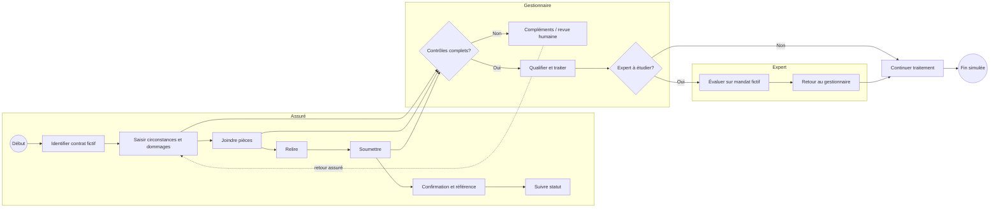

# Processus TO-BE

> Mermaid simplifié. Gains attendus, non mesurés.

```mermaid
flowchart LR
 subgraph Assuré
 A((Début))-->B[Identifier contrat fictif]-->C[Saisir circonstances et dommages]-->D[Joindre pièces]-->E[Relire]-->F[Soumettre]-->G[Confirmation et référence]-->H[Suivre statut]
 end
 subgraph Gestionnaire
 I{Contrôles complets?}--Non-->J[Compléments / revue humaine]
 I--Oui-->K[Qualifier et traiter]-->L{Expert à étudier?}
 end
 subgraph Expert
 M[Évaluer sur mandat fictif]-->N[Retour au gestionnaire]
 end
 C-->I
 D-->I
 F-->I
 J-.retour assuré.->C
 L--Oui-->M
 L--Non-->O[Continuer traitement]
 N-->O-->Z((Fin simulée))
```

Les contrôles précèdent la qualification; la décision humaine demeure. Aucun transfert réel n’existe.
